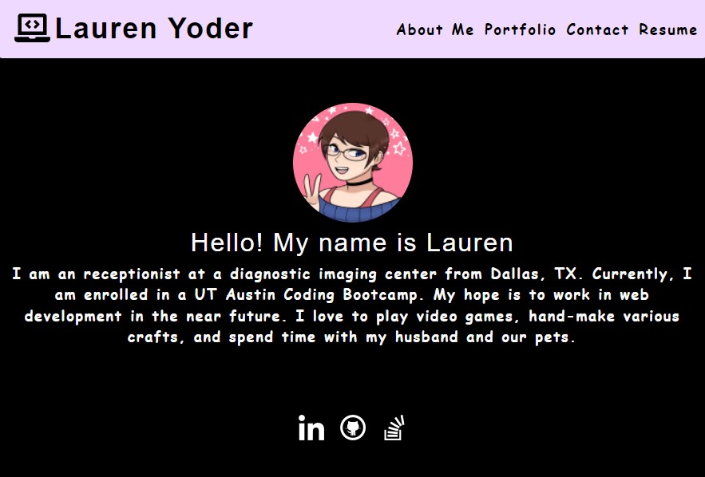

# React Portfolio

## Description
---------------------------------
This project is intended to be a personal portfolio. The purpose is to provide a centralized location for my works, contacts, and a short bio. This specific is built using React.

## Personal Portfolio
-------------------------
[Click Here](https://lrodenyoder.github.io/react-portfolio) to go to the portfolio website

  

## Sources
--------------------------------
* Avatar: [Link](https://picrew.me/image_maker/94097)
* Social media icon: [Link](fontawesome.com)

## License
----------------------------------------
  MIT License 

  Copyright (c) [2022] by [Lauren Yoder]

  [Click Here](https://choosealicense.com/licenses/mit/) to go to license details